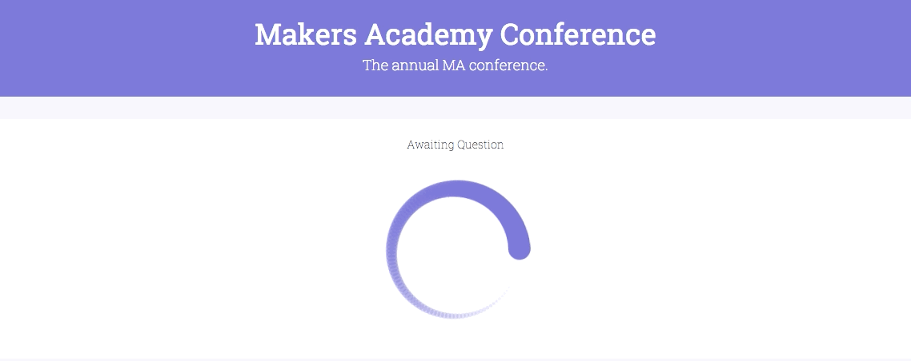
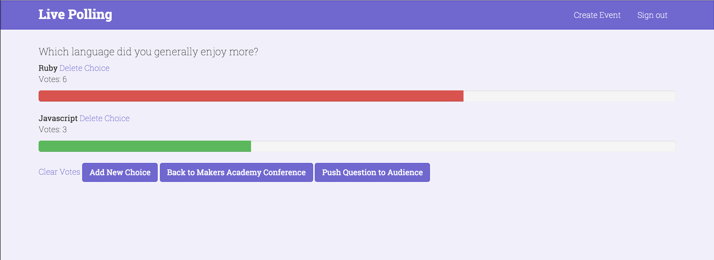

[](https://coveralls.io/github/zlahham/live-voting?branch=master)
[](https://waffle.io/zlahham/live-voting)

#Live-Voting

**Visit the live site [here](http://live-voting.herokuapp.com/)**




###Summary

- Live-voting is a realtime polling/voting tool that can be used in situations which have one person speaking in front of an audience.
- The primary benefit of using this tool is to get a quick heartbeat response from your audience. Or as we like to call it, a quick litmus test.
- A few example usages:
	- Educational context
	- Conferences
	- Annual General Meetings
	- Conference calls

###*For a more in depth overview of our journey as a team through this project, please see the corresponding [wiki](https://github.com/zlahham/live-voting/wiki).*
---
###Screenshots



---

###Current Version Features

>Speaker POV
- Login/ Sign up
- Create event
- Create questions with multiple choices
- Share voting link either through Twitter or share event ID with audience
- Publish questions to audience (1 at a time)
- Results shown live

>Voter POV
- Visit voting URL through Twitter's link or by using the event ID
- Vote on one choice per question

---

###Installation/Testing Instructions:

####Local installation
```
git clone git@github.com:zlahham/live-voting.git
cd live-voting
bundle
bin/rake db:create RAILS_ENV=test
bin/rake db:create RAILS_ENV=development
bin/rake db:migrate RAILS_ENV=test
bin/rake db:migrate RAILS_ENV=development
bin/rails s
```

####Local Testing
**NOTE**: You need to have Firefox installed if you want the tests to run properly, as we are using `selenium-webdriver` to run the JS tests. If you would like to use `capybara-webkit` instead, you can just uncomment line 23 in the Gemfile and comment line 24, followed by running `bundle`.
```
cd live-voting
rspec
```
---
###Technologies Used:
- Production: Ruby on Rails, Javascript, jQuery, Pusher, Twitter Bootstrap, SASS, PostgreSQL, Heroku
- Testing: RSpec, Capybara, Selenium, Factory Girl.

---
###Possible Future Improvements:
- End event
- Speaker can view summary
- Speaker can export data to CSV.
- Voter can view summary

---
###Team Members:

[Andrew](https://github.com/Yorkshireman)

[Ben](https://github.com/benhawker)

[Chris](https://github.com/christopheralcock)

[Lewis](https://github.com/ljones140)

[Zaid](https://github.com/zlahham)

---
<!--
You need to include this hidden file at /config/initializers/pusher.rb
```
Pusher.app_id = ENV['VOTING_PUSHER_APP_ID']
Pusher.key =  ENV['VOTING_PUSHER_KEY']
Pusher.secret = ENV['VOTING_PUSHER_SECRET']
``` -->
